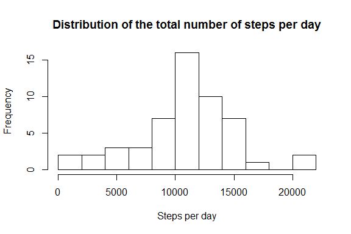

# Reproducible Research: Peer Assessment 1
Hugo Janssen  
6 Jun 2015  


## Loading and preprocessing the data

```r
# Unzip the data file to the data directory
unzip("activity.zip")

# Read the data files into a data frame
d <- read.csv(file="activity.csv", header=TRUE, sep=",")

# Convert dates from string to date
d$date <- as.Date(d$date)

# Print a summary of the data
summary(d)
```

```
##      steps             date               interval     
##  Min.   :  0.00   Min.   :2012-10-01   Min.   :   0.0  
##  1st Qu.:  0.00   1st Qu.:2012-10-16   1st Qu.: 588.8  
##  Median :  0.00   Median :2012-10-31   Median :1177.5  
##  Mean   : 37.38   Mean   :2012-10-31   Mean   :1177.5  
##  3rd Qu.: 12.00   3rd Qu.:2012-11-15   3rd Qu.:1766.2  
##  Max.   :806.00   Max.   :2012-11-30   Max.   :2355.0  
##  NA's   :2304
```


## What is mean total number of steps taken per day?

A histogram with the total number of steps per day: 

```r
# Aggregate the data
agg <- aggregate(x=d[c("steps")], by=list(Group.date=d$date), FUN=sum)

# Plot the histogram
hist(agg$steps, breaks=10, main="Distribution of the total number of steps per day", xlab="Steps per day")
```



The <b>mean</b> number of steps is 10766.19 and the <b>median</b> is 10765.


## What is the average daily activity pattern?


Make a time series plot (i.e. type = "l") of the 5-minute interval (x-axis) 
and the average number of steps taken, averaged across all days (y-axis)

```r
#hist(c2$interval, breaks=10, main="Distribution of the total number of steps per day", xlab="Steps per day")
```
 


Which 5-minute interval, on average across all the days in the dataset, contains the maximum number of steps?


## Imputing missing values


## Are there differences in activity patterns between weekdays and weekends?
