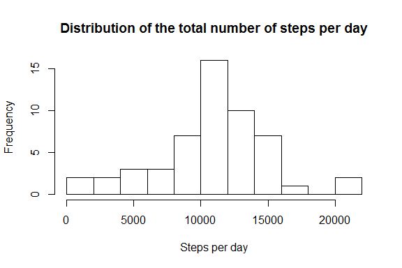
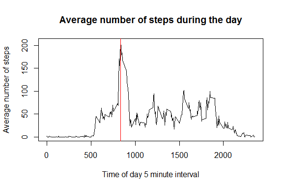
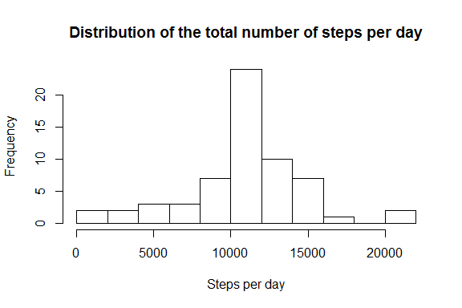
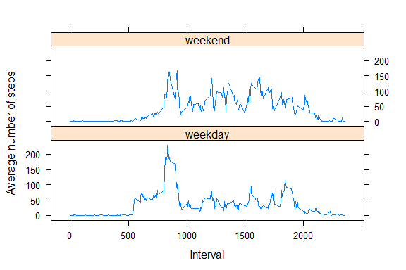

# Reproducible Research: Peer Assessment 1
Hugo Janssen  
5 Jun 2015  


## Introduction

This project is part of the course Reproducible Research. It explores personal movement data that was captured by activity monitoring devices.

> It is now possible to collect a large amount of data about personal movement using activity monitoring devices such as a Fitbit, Nike Fuelband, or Jawbone Up. These type of devices are part of the "quantified self" movement -- a group of enthusiasts who take measurements about themselves regularly to improve their health, to find patterns in their behavior, or because they are tech geeks. But these data remain under-utilized both because the raw data are hard to obtain and there is a lack of statistical methods and software for processing and interpreting the data.

> This assignment makes use of data from a personal activity monitoring device. This device collects data at 5 minute intervals through out the day. The data consists of two months of data from an anonymous individual collected during the months of October and November, 2012 and include the number of steps taken in 5 minute intervals each day.


## Loading and preprocessing the data

The first step is to unzip and read the data. For convenience, the data type for the ```date``` attribute is converted from string to date.


```r
# Unzip the data file to the data directory
unzip("activity.zip")

# Read the data files into a data frame
d <- read.csv(file="activity.csv", header=TRUE, sep=",", na.strings = "NA")

# Convert dates from string to date
d$date <- as.Date(d$date)

# Print a summary of the data
summary(d)
```

```
##      steps             date               interval     
##  Min.   :  0.00   Min.   :2012-10-01   Min.   :   0.0  
##  1st Qu.:  0.00   1st Qu.:2012-10-16   1st Qu.: 588.8  
##  Median :  0.00   Median :2012-10-31   Median :1177.5  
##  Mean   : 37.38   Mean   :2012-10-31   Mean   :1177.5  
##  3rd Qu.: 12.00   3rd Qu.:2012-11-15   3rd Qu.:1766.2  
##  Max.   :806.00   Max.   :2012-11-30   Max.   :2355.0  
##  NA's   :2304
```


## What is mean total number of steps taken per day?

A histogram shows the total number of steps per day: 


```r
# Aggregate the data
d_sum <- aggregate(steps~date, data=d, FUN=sum)

# Plot the histogram
hist(d_sum$steps, breaks=15, 
     main="Distribution of the total number of steps per day", 
     xlab="Steps per day")
```



The <b>mean</b> number of steps is 10766 and the <b>median</b> is 10765.


## What is the average daily activity pattern?

The line chart shows the average number of steps during the day:


```r
# Aggregate the data
d_avg <- aggregate(steps~interval, data=d, FUN=mean, na.rm=TRUE)

# Plot the time series
plot(d_avg$steps~d_avg$interval, type="l", 
     main="Average number of steps during the day", 
     xlab="Time of day 5 minute interval", 
     ylab="Average number of steps")
abline(v=d_avg[which.max(d_avg$steps), 1], col="red")
```


 
The <b>maximum</b> number of steps is measured at interval 835. The red line in the figure above shows this interval.


## Imputing missing values

The data set contains 2304 rows with <b>missing values</b>. Missing values are imputed using the calculated means per 5 minute interval.


```r
# Use the mean per interval to fill missing values
for (i in unique(d$interval)) {
  d[is.na(d$steps) & d$interval==i, 1] <- subset(d_avg, interval==i, select=steps)
}
```

The histogram for the data set with imputed missing values looks as follows:


```r
# Aggregate the data
d2_sum <- aggregate(steps~date, data=d, FUN=sum)

# Plot the histogram
hist(d2_sum$steps, breaks=15, 
     main="Distribution of the total number of steps per day", 
     xlab="Steps per day")
```



In the new data set, the <b>mean</b> number of steps is 10766 and the <b>median</b> is 10766. There is no significant difference compared to the values that were computed for the original data set.


## Are there differences in activity patterns between weekdays and weekends?

To see whether the activity patterns differ between weekdays and weekends, the data is labeled accordingly. The average number of steps is computed per 5 minute interval and per weekday / weekend. The plot in the figure below shows that there indeed is a difference in activity patterns. 


```r
# Label dates as weekday or weekend
d$day <- as.factor(ifelse(weekdays(d$date) %in% c("zaterdag","zondag"), "weekend", "weekday")) 

# Compute aggregates per interval per weekend and weekday
day_agg <- aggregate(steps~day+interval, data=d, FUN=mean)

# Plot the averages
xyplot(steps~interval|day, data=day_agg, layout=c(1,2), type="l",
       xlab="Interval",
       ylab="Average number of steps")
```


